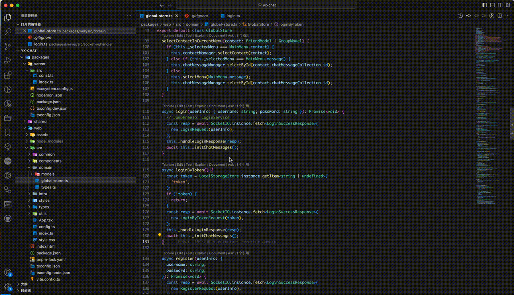

# "Jump Free" VSCode 插件

[English](README.md) | [中文](README.zh-cn.md)

## 介绍

"Jump Free" 是一个VSCode插件，旨在链接两个具有内在联系但无法直接跳转的代码片段。只需编写“JumpFreeTo: xxx”和“JumpFreeTarget: xxx”，即可在隐式相关的代码部分之间快速导航，提高您的生产力和效率。

## 功能

- **关联代码块**：链接不能直接关联到但隐式相关的代码片段。

- **代码导航**：通过使用“JumpFreeTo: xxx”和“JumpFreeTarget: xxx”注释，在关联的代码块之间轻松导航。

## 使用方法

1. 打开您要创建链接的文件。
2. 在您想创建链接的地方写上 `JumpFreeTo: xxx`。
3. 在您想跳转的地方写上 `JumpFreeTarget: xxx`。
4. 使用“Jump Free”插件在创建的链接之间跳转。只需点击 `JumpFreeTo: xxx`，它会带您到 `JumpFreeTarget: xxx` 所写的位置。

> 注意：确保您在 `JumpFreeTo:` 和 `JumpFreeTarget:` 后写的 `xxx` 匹配。插件使用这个来识别要关联的代码块。

## 安装

该插件可以从Visual Studio Code市场安装。搜索“Jump Free”，然后点击安装按钮。您也可以点击[这里](https://marketplace.visualstudio.com/items?itemName=hekaigustav.jump-free)下载。

## 反馈和问题

如果您有任何反馈或在使用“Jump Free”插件时遇到任何问题，请随时在我们的[GitHub仓库](https://github.com/HEKEH/JumpFree)中提出问题。我会非常乐意提供帮助！

**尽情享受吧！**
